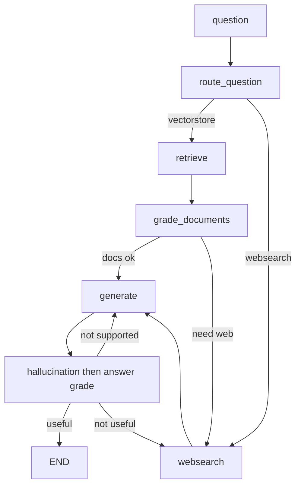

# `graph/` — Agentic RAG (outer core)

## 1. One-liner

`graph/` is a **LangGraph** workflow: you ask a question → it picks vectorstore or web search → builds an answer → checks that the answer is grounded and useful (and retries if not).

## 2. Folder map

| Piece | Role |
|-------|------|
| [`graph/state.py`](graph/state.py) | Shared notebook passed between steps (`GraphState`) |
| [`graph/consts.py`](graph/consts.py) | Node name strings (`retrieve`, `generate`, …) |
| [`graph/nodes/`](graph/nodes/) | Steps that **update state** (retrieve, grade docs, web search, generate) |
| [`graph/chains/`](graph/chains/) | LLM helpers used by nodes/routers (route, relevance, generate, hallucination, answer) |
| [`graph/graph.py`](graph/graph.py) | Wires nodes + decision edges → compiled `app` |

**nodes vs chains:** nodes are graph steps; chains are the LLM tools those steps (and routers) call.

Docs for retrieve come from the Pinecone retriever in [`ingestion.py`](ingestion.py).

## 3. Inputs → Outputs

| When | In | Out |
|------|----|-----|
| **Defined** | — | Compiled graph `app` in `graph.py` |
| **Invoked** | `{"question": "..."}` | Final state with `generation` (plus `documents` along the way) |

## 4. State fields (`GraphState`)

| Field | Meaning |
|-------|---------|
| `question` | User question |
| `documents` | Retrieved / filtered / web docs |
| `web_search` | “Do we still need the web?” flag after grading docs |
| `generation` | Final answer string |

## 5. Data flow



1. **`route_question`** — vectorstore or websearch?
2. **`retrieve` → `grade_documents`** — pull docs, drop irrelevant ones; set `web_search` if needed.
3. **`websearch`** (if routed or docs weak) → then **`generate`**.
4. After **`generate`**: grounded? answers the question?
   - useful → **END**
   - not grounded → generate again
   - grounded but not useful → websearch → generate

## 6. Weird syntax only (in `graph.py`)

- **`StateGraph(GraphState)`** — graph whose memory shape is `GraphState`.
- **`add_node(name, fn)`** — register a step; `fn` takes state, returns updates.
- **`add_edge(A, B)`** — always go A → B.
- **`set_conditional_entry_point` / `add_conditional_edges`** — a function picks the next node from the current state.
- **`END`** — stop.
- **`app = workflow.compile()`** — turn the blueprint into something you can `.invoke(...)`.

## 7. Filled mini-example

Question: `"What are the types of agent memory?"`

1. Router → **vectorstore** (topic matches your indexed Lilian Weng posts).
2. **retrieve** fills `documents`.
3. **grade_documents** keeps relevant chunks; `web_search` stays false.
4. **generate** writes `generation`.
5. Hallucination + answer graders say **useful** → **END**.

You’d run it like:

```python
from graph.graph import app

result = app.invoke({"question": "What are the types of agent memory?"})
print(result["generation"])
```

## 8. Not happening yet

This README only **explains** the graph. [`main.py`](main.py) still just prints hello — it does not call `app.invoke(...)` yet.
