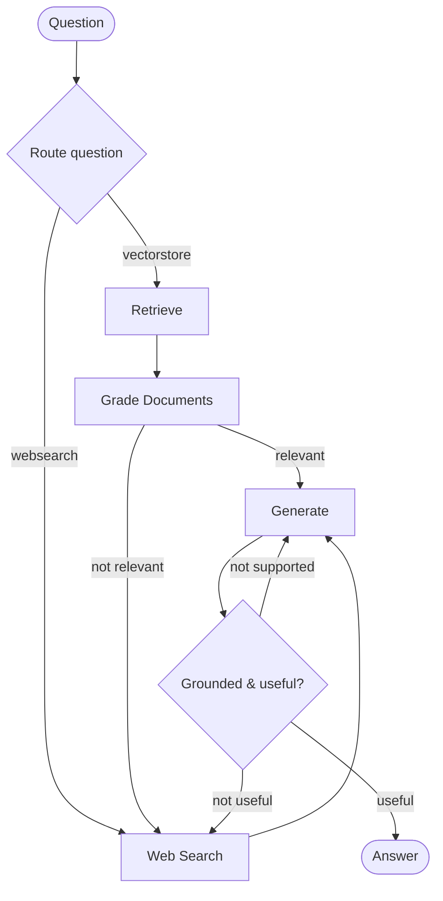

# Agentic RAG

An adaptive retrieval-augmented generation (RAG) pipeline built with **LangGraph**. The agent routes each question to the right data source, grades retrieved documents for relevance, falls back to web search when needed, and checks answers for hallucinations before returning them.

Inspired by the [LangGraph Adaptive RAG / Corrective RAG](https://langchain-ai.github.io/langgraph/tutorials/rag/langgraph_adaptive_rag/) pattern.

## Features

- **Query routing** — sends agent / prompt-engineering / adversarial-attack questions to the vector store; everything else goes to web search
- **Document grading** — filters out irrelevant chunks and triggers web search when retrieval quality is low
- **Hallucination & answer grading** — regenerates or searches again if the answer is ungrounded or off-topic
- **Pinecone vector store** — embeds and retrieves from Lilian Weng’s blog posts on agents, prompting, and LLM attacks
- **Tavily web search** — live fallback when the index is not enough

## Architecture



| Stage | What happens |
| --- | --- |
| **Route** | LLM decides `vectorstore` vs `websearch` |
| **Retrieve** | Similarity search over the Pinecone index |
| **Grade documents** | Keep relevant chunks; set a web-search flag if any are irrelevant |
| **Web search** | Fetch Tavily results and append them as context |
| **Generate** | Answer from question + documents (`gpt-4o-mini`) |
| **Grade answer** | Check grounding, then whether the answer addresses the question |

## Project structure

```
.
├── main.py                 # Entry point — invoke the graph with a sample question
├── ingestion.py            # Load URLs → chunk → upsert to Pinecone; exports `retriever`
├── graph/
│   ├── graph.py            # StateGraph wiring, routing, and grading edges
│   ├── state.py            # GraphState (question, documents, generation, web_search)
│   ├── consts.py           # Node name constants
│   ├── nodes/              # retrieve, grade_documents, generate, web_search
│   └── chains/             # router, graders, and generation LCEL chains
├── pyproject.toml
└── .env                    # API keys (not committed)
```

## Prerequisites

- Python **3.13+**
- [uv](https://docs.astral.sh/uv/) (recommended) or pip
- Accounts / keys for:
  - [OpenAI](https://platform.openai.com/)
  - [Pinecone](https://www.pinecone.io/) (index with **1024** dimensions for `text-embedding-3-large`)
  - [Tavily](https://tavily.com/)
  - [LangSmith](https://smith.langchain.com/) (optional, for tracing)

## Setup

1. **Clone and install**

```bash
git clone <your-repo-url>
cd "4.Agentic RAG"
uv sync
```

2. **Configure environment**

Create a `.env` in the project root:

```env
OPENAI_API_KEY=sk-...
PINECONE_API_KEY=...
INDEX_NAME=your-pinecone-index-name
TAVILY_API_KEY=tvly-...

# Optional — LangSmith tracing
LANGSMITH_TRACING=true
LANGSMITH_ENDPOINT=https://api.smith.langchain.com
LANGSMITH_API_KEY=...
LANGSMITH_PROJECT=agentic-rag
```

Create a Pinecone index that matches the embedding config in `ingestion.py`:

- Model: `text-embedding-3-large`
- Dimensions: `1024`
- Metric: cosine (typical for this setup)

3. **Ingest documents** (once, or whenever you want to refresh the index)

```bash
uv run python ingestion.py
```

This loads three Lilian Weng posts, splits them into ~250-token chunks, and upserts them into `INDEX_NAME`.

## Usage

Run the graph with the sample question:

```bash
uv run python main.py
```

By default that asks: *“What are the types of agent memory?”* and prints `result["generation"]`.

To ask something else, edit `main.py`:

```python
result = app.invoke({"question": "Your question here"})
print(result["generation"])
```

### Export the graph diagram

```bash
uv run python -m graph.graph
```

Writes `graph.png` (Mermaid render of the compiled StateGraph).

## Graph state

```python
class GraphState(TypedDict):
    question: str
    generation: str
    web_search: bool
    documents: List[Document]
```

Each node reads from this state and returns a partial update. Conditional edges use `web_search` and the grader scores to decide the next step.

## Tech stack

| Piece | Choice |
| --- | --- |
| Orchestration | LangGraph `StateGraph` |
| LLM | OpenAI `gpt-4o-mini` |
| Embeddings | OpenAI `text-embedding-3-large` (1024-d) |
| Vector DB | Pinecone |
| Web search | Tavily |
| Config | `python-dotenv` |

## License

Personal / learning project — use and adapt as you like.
